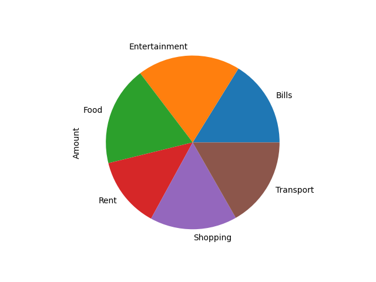
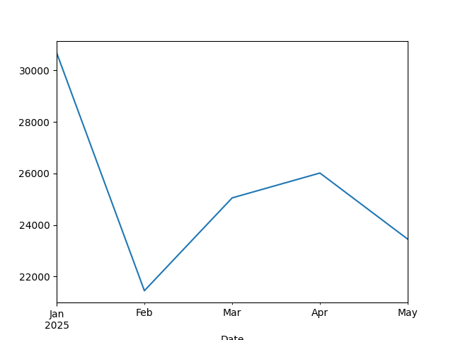

# Smart Expense Tracker
An end-to-end data pipeline to generate, clean, and visualize personal finance data.

## How to Run
1. Install: `pip install -r requirements.txt` 
2. Run: `python main.py`

## Insights

This project is complete and stable.
